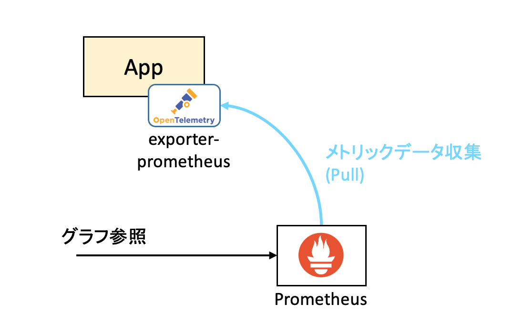
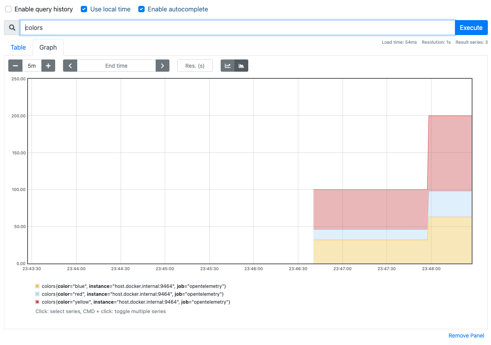

# metrics-example

Node.js+Express上での、OpenTelemetryを用いたメトリックデータ収集のサンプルです。<br>
Qiitaの記事のサンプルソースになります。

Node.jsをOpenTelemetryでメトリック収集してみる<br>
https://qiita.com/raichi/items/d371bf3fe6ddec168725

Node.jsアプリケーション上で収集したメトリックデータ（今回は３種類のカウンタの数値）を、Prometheusでグラフ化してみます。



# インストール・実行手順

(1)インストール

```shell
$ git clone https://github.com/lychee3/open-telemetry-apps.git
$ cd open-telemetry-apps/metrics-example
$ npm install
```

(2)Prometheusの構築

```shell
$ docker run \
    -d \
    -p 9090:9090 \
    -v /path/to prometheus.yml:/etc/prometheus/prometheus.yml \
    prom/prometheus
```

ブラウザからlocalhost:9090にアクセスすると、Prometheusの画面が表示される。

(3)アプリケーションの起動

```shell
$ node app.js
```

(4)アプリケーションへリクエスト発行

```
$ curl localhost:8080
```

100回連続でリクエスト発行する場合

```
$ for var in `seq 100`; do curl localhost:8080; done
```

(5)Prometheusでグラフ確認

ブラウザでlocalhost:9090にアクセスする。<br>
Graphタブを選択し、テキストボックスにcolorsと入力、Executeボタンを実行するとグラフ表示される。



