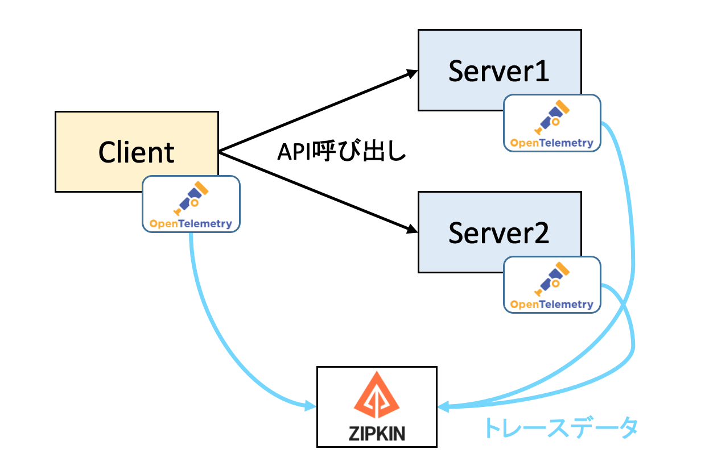
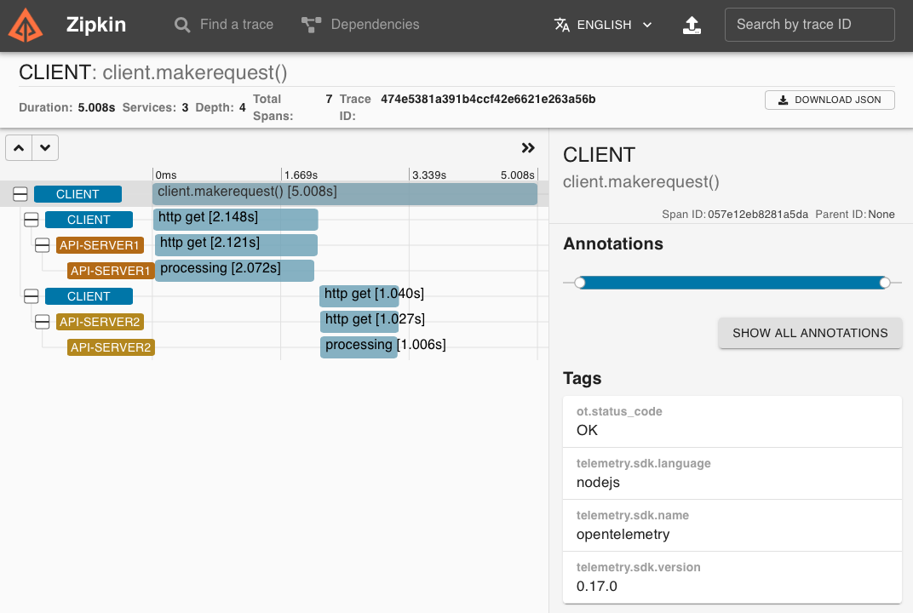

# tracing-example

Node.js+Express上での、OpenTelemetryを用いたトレース収集のサンプルです。<br>
Qiitaの記事のサンプルソースになります。

Node.jsをOpenTelemetryでトレーシングしてみる<br>
https://qiita.com/raichi/items/3cd06d8c216eb82d54c4

クライアントが２種類のREST-APIを呼び出す構成を対象に、トレースデータを収集します。<br>
トレースデータはZipkinで可視化します。



# インストール・実行手順

(1)インストール

```shell
$ git clone https://github.com/lychee3/open-telemetry-apps.git
$ cd open-telemetry-apps/tracing-example
$ npm install
```

(2)Zipkinの構築

```shell
$ docker run -d -p 9411:9411 openzipkin/zipkin
```

(3)サーバ・クライアントの起動

```shell
# Server2の起動
$ node api-server1.js 

# Server2の起動
$ node api-server2.js 

# Clientの起動
$ node client.js 
```

(4)Zipkinでグラフ確認

ブラウザでlocalhost:9411にアクセスする。<br>
検索条件：serviceName=clientを指定してグラフ表示させる。



